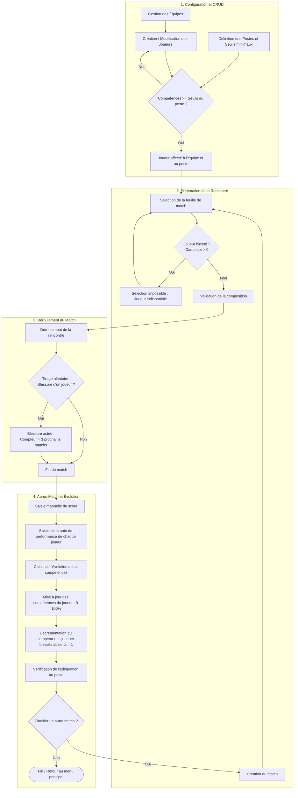

```mermaid
flowchart TD
    subgraph S1 ["1. Configuration et CRUD"]
        A1[Gestion des Équipes]
        A2[Définition des Postes et Seuils minimaux]
        A3[Création / Modification des Joueurs]
        A4{Compétences >= Seuils du poste ?}
        
        A1 --> A3
        A2 --> A4
        A3 --> A4
        A4 -- Non --> A3
        A4 -- Oui --> A5[Joueur affecté à l'équipe et au poste]
    end

    subgraph S2 ["2. Préparation de la Rencontre"]
        B1[Création du match]
        B2[Sélection de la feuille de match]
        B3{Joueur blessé ?<br/>Compteur > 0}
        
        A5 -.-> B2
        B1 --> B2
        B2 --> B3
        B3 -- Oui --> B4[Sélection impossible : Joueur indisponible]
        B4 --> B2
        B3 -- Non --> B5[Validation de la composition]
    end

    subgraph S3 ["3. Déroulement du Match"]
        C1[Déroulement de la rencontre]
        C2{Tirage aléatoire :<br/>Blessure d'un joueur ?}
        C3[Blessure actée :<br/>Compteur = 3 prochains matchs]
        C4[Fin du match]
        
        B5 --> C1
        C1 --> C2
        C2 -- Oui --> C3
        C2 -- Non --> C4
        C3 --> C4
    end

    subgraph S4 ["4. Après-Match et Évolution"]
        D1[Saisie manuelle du score]
        D2[Saisie de la note de performance de chaque joueur]
        D3[Calcul de l'évolution des 4 compétences]
        D4[Mise à jour des compétences du joueur : 0-100%]
        D5[Décrémentation du compteur des joueurs blessés absents : -1]
        D6[Vérification de l'adéquation au poste]
        D7{Planifier un autre match ?}
        
        C4 --> D1
        D1 --> D2
        D2 --> D3
        D3 --> D4
        D4 --> D5
        D5 --> D6
        D6 --> D7
        D7 -- Oui --> B1
        D7 -- Non --> D8([Fin / Retour au menu principal])
    end
```